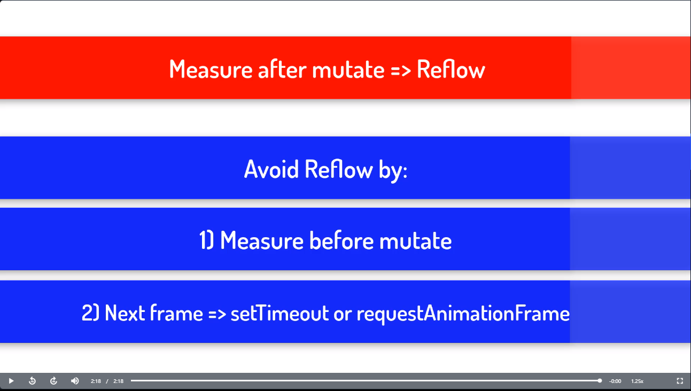

# Critical Rendering Path

This explains how the flow of that occurs in the browser to see the  changes made by the user.

- User clicks on index.html and opens in chrome the following happens stated below:
- HTML Parsing & Tokenization=>Javascript=>DOM=>CSS Parsing=> CSSOM(CSS Object Model) => Render Tree=>Layout=>Paint=>composite
- Render Tree is combination of both DOM & CSSOM.
- Layout is called based on the Render Tree and then browser does the paint and composite where the user sees the content on the screen.
- Layout calculates the dimension and positions of elements in page. 
- Paint puts the pixel on the screen, composite handles the complex part such as Z-indexing.
- Reflow happens when the mutation of DOM happens followed by measurement.

``` 
function addItem() {
  const newElement = document.createElement("div");
  newElement.innerText = "Hi"; // mutation
  wrapper.appendChild(newElement);
  height = wrapper.getBoundingClientRect().height; // measurement
}
const wrapper = document.getElementById("wrapper");

```

Solutions to Solve Reflow Problem:
- To use async way of handling such as SetTimeout with the measurement code.
- To warp the measurement code with requestAnimationFrame fn and call the measurement code.



Layout Thrashing:
If there is multiple reflows happening when a piece of code runs this leads to Layout Thrashing.
Use a debounce technique to solve this.

Inspired from:
- https://medium.com/jspoint/how-the-browser-renders-a-web-page-dom-cssom-and-rendering-df10531c9969
- https://egghead.io/lessons/javascript-layout-reflow-in-the-browser